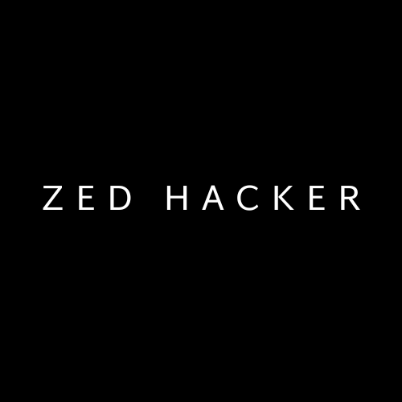
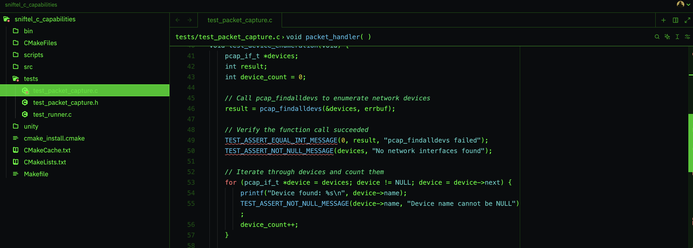
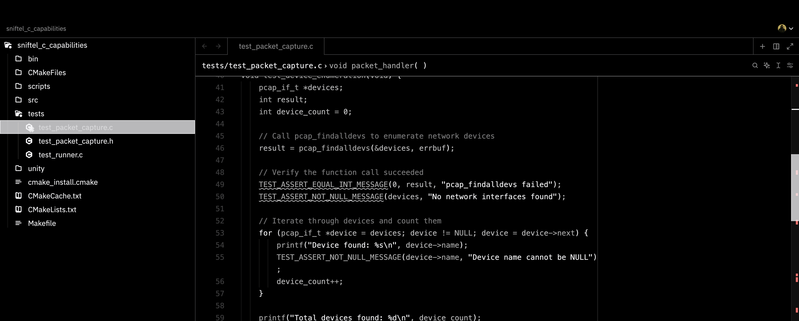
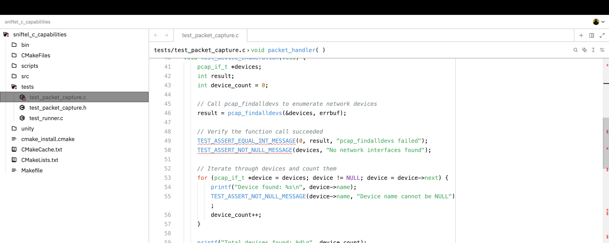

# ZedHacker Theme

A refined, hacker-inspired theme for the Zed code editor with improved visibility and contrast while maintaining the cool cyberpunk aesthetic.

## Overview

ZedHacker is a carefully crafted theme designed to provide optimal visibility and contrast for extended coding sessions. It offers a distinctive cyberpunk vibe with thoughtful color choices that enhance code readability without sacrificing style.

## Features

- 🎨 **Enhanced Contrast**: Improved visibility for all UI elements
- 🖥️ **Multiple Variants**: Monochrome, Matrix (green), and Light options
- 🧩 **Refined Syntax Highlighting**: Better code comprehension through thoughtful color choices
- ⌨️ **Keyboard Optimized**: Clear selection states for keyboard navigation
- 🌓 **Light & Dark Options**: Complete support for both modes

## Installation

1. Open Zed
2. Open the command palette (Cmd+Shift+P on macOS, Ctrl+Shift+P on Windows/Linux)
3. Type "Install Extension" and select it
4. Enter `N0TZ3R0/zed-hacker-theme`

## Theme Variants

### ZedHacker Matrix

Vibrant green-focused cyberpunk theme inspired by classic hacker aesthetics.

### ZedHacker Monochrome

Classic black and white aesthetic with maximum contrast for readability.

### ZedHacker Light

Light background variant ideal for daytime coding and high-glare environments.

## License

MIT

---

Made with ❤️ by <a href="https://github.com/N0TZ3R0">N0TZ3R0</a>

