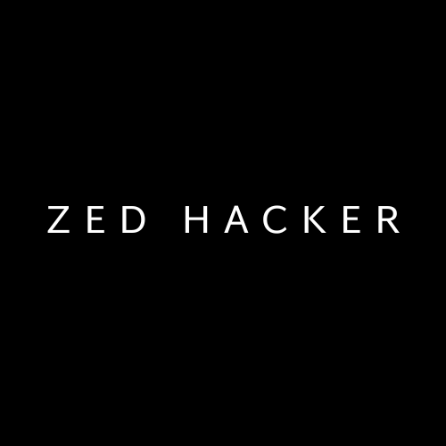

# ZedHacker Theme

<div align="center">



[](https://opensource.org/licenses/MIT)
[](https://zed.dev/)
[]()

A refined, hacker-inspired theme for the Zed code editor with improved visibility and contrast while maintaining the cool cyberpunk aesthetic.

[Overview](#overview) •
[Features](#features) •
[Installation](#installation) •
[Theme Variants](#theme-variants) •
[Customization](#customization) •
[Contributing](#contributing)

</div>

## Overview

ZedHacker is an enhanced version of the popular "Hacker Night Vision" theme, specifically designed to address contrast and visibility issues while preserving the sleek hacker aesthetic. It provides a more accessible coding experience without compromising the distinctive cyberpunk vibe that developers love.

## Features

### Core Philosophy
- 🎨 **Enhanced Contrast**: Improved visibility for all UI elements
- 🖥️ **Multiple Variants**: Monochrome, Matrix (green), and Light options
- 🧩 **Refined Syntax Highlighting**: Better code comprehension through thoughtful color choices
- ⌨️ **Keyboard Optimized**: Clear selection states for keyboard navigation
- 🌓 **Light & Dark Options**: Complete support for both modes

### Key Improvements
- Fixed command palette selection contrast for keyboard navigation
- Better distinction between active and inactive interface elements
- Increased readability of code syntax highlighting
- More accessible color choices for long coding sessions
- Clear visual feedback for selection states

### Performance
- Zero performance impact
- Native integration with Zed's theme system
- Fully optimized for all supported platforms

## Installation

### Via Zed Extension Marketplace

1. Open Zed
2. Open the command palette (Cmd+Shift+P on macOS, Ctrl+Shift+P on Windows/Linux)
3. Type "Install Extension" and select it
4. Enter `N0TZ3R0/zed-hacker-theme`

### Manual Installation

1. Clone the repository:
```bash
git clone https://github.com/N0TZ3R0/zed-hacker-theme.git ~/.config/zed/themes/zed-hacker-theme
```

2. Open Zed
3. Open the theme selector (Cmd+K, Cmd+T on macOS)
4. Select one of the ZedHacker theme variants

## Theme Variants

ZedHacker comes with three distinct theme variants, each designed for different preferences and use cases:

### ZedHacker Monochrome
- Classic black and white aesthetic
- Maximum contrast for readability
- Minimalist design with subtle grayscale variations

### ZedHacker Matrix
- Vibrant green-focused cyberpunk theme
- Inspired by classic hacker aesthetics
- Perfect for those who love the iconic "green text on black" look

### ZedHacker Light
- Light background with carefully chosen contrast
- Maintains the hacker aesthetic in a bright environment
- Ideal for high-glare environments or daytime coding

## Customization

### Theme Selection

1. Open the command palette (Cmd+Shift+P)
2. Type "Theme Selector: Toggle"
3. Choose your preferred ZedHacker variation

### Custom Adjustments

Advanced users can modify theme files located in:
```
~/.config/zed/themes/zed-hacker-theme/themes/
```

## Screenshots

### ZedHacker Monochrome


### ZedHacker Matrix


### ZedHacker Light


## Troubleshooting

### Common Issues

1. **Theme not appearing in selector**
   - Ensure Zed is restarted after installation
   - Verify the themes are in the correct directory

2. **Colors not displaying correctly**
   - Check if your terminal supports true color
   - Update to the latest version of Zed

## Contributing

We welcome contributions! Please feel free to submit a Pull Request.

### Development Setup

1. Fork the repository
2. Create your feature branch
```bash
git checkout -b feature/amazing-theme-variant
```
3. Commit your changes
```bash
git commit -m 'Add amazing theme variant'
```
4. Push to the branch
```bash
git push origin feature/amazing-theme-variant
```
5. Open a Pull Request

## Acknowledgments

- Original inspiration from the Hacker Night Vision theme
- Zed editor development team
- All contributors and testers

## License

MIT

---

<div align="center">
Made with ❤️ by N0TZ3R0
</div>
